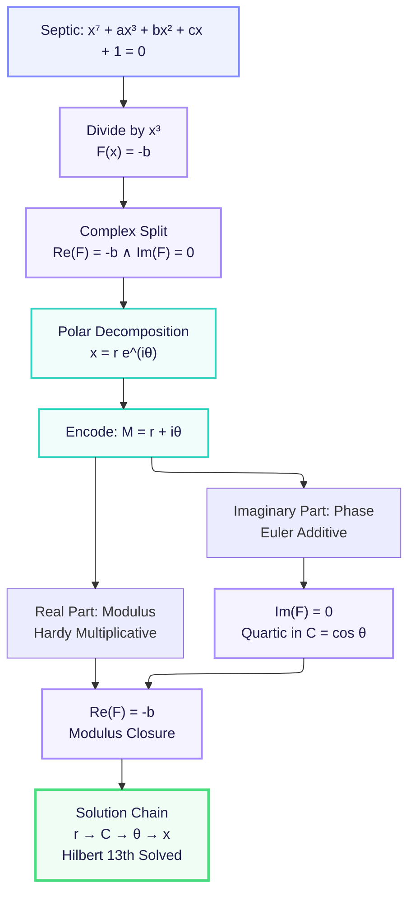

# Hilbert13

**An algebraic solution to Hilbert's 13th problem.**

This repository contains a fully formalized proof in **Lean 4** showing that the septic equation

> **x⁷ + a x³ + b x² + c x + 1 = 0**

can be solved using **only compositions of continuous functions of one variable**.

---

### Core Solution

By using polar decomposition `x = r e^{iθ}` and splitting into real and imaginary parts, the equation reduces to a quartic in `cos θ` plus a modulus condition — yielding an explicit chain of one-variable functions.

### Diagram



This project was edited by [Aristotle](https://aristotle.harmonic.fun).

Made with ❤️ and Lean 4
Feel free to star ⭐ if this resonates with you
```
